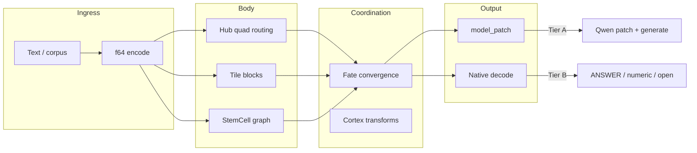

# Valhalla vs Transformer: Detailed Introduction

**Version**: 1.3 · **Date**: 2026-06-16 · **Fundraise MVP**: [05_FUNDRAISE_MVP_REPORT.md](./05_FUNDRAISE_MVP_REPORT.md) · **Viz/API**: `viz/` + `api/`
**Audience**: Tech leads, architects, engineering diligence

---

## 1. Background: Why a Non–Transformer-Only Path

### 1.1 Transformer Strengths and Limits

| Strengths | Limits |
|-------------|--------|
| General language modeling, zero-shot | Black-box weights; unroutable internals |
| Mature stack (HF, LoRA, KD) | API tax, data residency, vendor lock-in |
| Clear scaling laws | Vertical domains need costly gradient training |

### 1.2 What Valhalla Means by “Incubation”

**Incubation** here: given domain corpus and tasks, the system changes **measurable behavior** through **structure evolution** (Tile blocks, StemCell graph, Fate preferences)—**without** full backprop retraining.

| Approach | Mechanism | Valhalla difference |
|----------|-----------|---------------------|
| RAG | Retrieve + prompt | Structure **persisted** in checkpoint, auditable |
| LoRA / fine-tune | Gradient adapters | Backprop is **not** the only path |
| Prompt engineering | In-context instructions | Multi-cycle **field/cell convergence** |
| Knowledge distillation | Teacher → student logits | Tier A: **no training**; Tier B: **no Transformer forward** |

---

## 2. Architecture: Hub · Tile · StemCell · Fate



### 2.1 Module Roles

| Module | Role |
|--------|------|
| **Hub** | Quad routing (BH/MB/MN/BF), Fate preferences, epoch gating |
| **Tile** | Scalar stream → merge/split blocks → `tile_signatures` |
| **StemCell** | Cell merge/divide → `stem_signatures`, connection count |
| **Fate** | Explore → converge; `get_fate_preferences()` |
| **Cortex** | Difference/Ratio transforms; Tier B numeric candidates |

### 2.2 TriadSession and model_patch

Corpus lines `feed` → `finalize_with_cycles(N)` → export:

- `patch_vector` (256-d structural signature)
- `quad_layer_scales` (4 LayerNorm groups, Tier A)
- `tile_signatures` / `stem_signatures`
- `hub_prefs` (Fate affinities, Tier B retrieval weighting)

**Reproducible finding**: Tile/Stem **converge in 1 cycle**—c5/c10 equals c1; extra cycles **do not help** (Tier A and B).

### 2.3 Internal pipeline (one corpus line)

Tier B `run_native_qa` (`native_qa.rs`):

1. `encode(line)` → f64 vector  
2. `TriadSession::with_body(budget, hub|tile|stemcell|triad)`  
3. `feed` each corpus line + question  
4. `finalize_with_cycles(1)` → `TriadFeedReport`  
5. Export: `hub_prefs`, `patch_vector`, `tile_signatures`, `stem_signatures`  
6. Branch on `score_type`: `decode_mcq` | `decode_numeric` | `decode_open`

| Body | Hub | Tile sigs | Stem sigs | patch_vector |
|------|-----|-----------|-----------|--------------|
| hub | ✓ | ✗ | ✗ | hub only |
| tile | ✗ | ✓ | ✗ | tile only |
| stemcell | ✗ | ✗ | ✓ | stem only |
| triad | ✓ | ✓ | ✓ | **256-d fusion** |

**200Q observations**: numeric identical across all bodies (61.02%); MCQ drops for single-body (14.06% vs 17.19% triad); open ~2.6% all arms.

### 2.4 Progress vs regression

| Progress (paradigm) | Regression (capability) |
|---------------------|-------------------------|
| 200Q + body split + CI | 24.5% vs 68% overall |
| Tier B no HF E2E | open 2.6% |
| Tier A beats random patch | Tier A no net strict gain |
| Honest corpus 0pp at 200Q | 48Q +2.08pp invalid |

---

## 3. Tier A: Structural Patch on External Transformer

### 3.1 Pipeline

1. Medium corpus (56 lines) → `valhalla_model_export --body triad --cycles 1`
2. JSON `model_patch` → Python `apply_valhalla_patch` (strength=0.08)
3. **Fresh load** Qwen2.5-0.5B per prompt (avoid cumulative collapse)
4. `generate` → `score_answer(strict_mcq=True)`

### 3.2 Control Arms

| Arm | Purpose |
|-----|---------|
| hub / stemcell / triad | Valhalla body variants |
| **random_patch** | Same-sparsity random perturbation |
| **prompt_only** | Corpus in system prompt, no weight change |
| **logit_kd** | 3B teacher labels → 0.5B lm_head SFT |

### 3.3 Strict 48Q Results (authoritative)

| Arm | Acc before | Acc after | Gain |
|-----|------------|-----------|------|
| triad_c1 | 68.75% | 66.67% | **-2.08 pp** |
| stemcell_c1 | 68.75% | 64.58% | -4.17 pp |
| hub_c1 | 68.75% | 58.33% | -10.42 pp |
| prompt_only | 68.75% | 62.50% | -6.25 pp |
| random_patch | 68.75% | 54.17% | **-14.58 pp** |
| **logit_kd** | 68.75% | **91.67%** | **+22.92 pp** |

### 3.4 Interpretation

1. **Loose MCQ +4.17pp is invalid**—substring false positives (`"B" in "about"`).
2. Valhalla patches **reach outputs** (~90% change rate) but **no net strict acc gain**.
3. triad **beats** hub/stem/random—structure carries **signal**, not noise.
4. KD **+22.92pp** shows supervised gradients remain the strongest acc lever on the same 48Q—a **different paradigm**, report side-by-side.

### 3.5 Valid Engineering Findings

| Finding | Status |
|---------|--------|
| Per-prompt fresh model | Required; cumulative patch @0.08 collapses |
| External prompts: no Valhalla hallucination | 0 Valhalla keyword hits |
| Body separation reproducible | Distinct patch_hash per body |

---

## 4. Tier B: Native Valhalla (No Transformer Forward)

### 4.1 Pipeline

`valhalla_native_qa` (Rust):

1. corpus + question → `TriadSession::with_body`
2. `finalize_with_cycles` → structure + memories
3. Branch on `score_type`:
   - **mcq**: option scoring → `ANSWER: X`
   - **numeric**: word_problem / direct_math / Cortex
   - **open**: Fate-weighted cosine retrieval

### 4.2 Standard 48Q (v2, 20260616_0847)

| Arm | Acc | Δ vs baseline |
|-----|-----|---------------|
| baseline_no_corpus | 22.92% | — |
| triad_c1 | **25.00%** | **+2.08 pp** |
| triad_c10 | 25.00% | +2.08 pp |

**Numeric subset (triad_c1)**: **8/9** (GSM_01–04, MATH_01–04 correct)

### 4.3 v1→v2 Improvements

- `decode_numeric` + word→digit parsing
- Cortex Ratio/Difference candidates
- Fate `hub_prefs` retrieval weighting
- Speak corpus (+32 dialogue lines)

### 4.4 Boundaries (must state)

- Absolute acc **~25%** vs Qwen baseline **~69%**
- Open answers remain retrieval-based, not generative
- **Cannot** claim Transformer replacement
- **Can** claim native path end-to-end; numeric signal; triad +2.08pp with corpus

---

## 5. Comparison Matrix

| Dimension | Transformer | Valhalla Tier A | Valhalla Tier B |
|-----------|-------------|-----------------|-----------------|
| Inference | Attention stack | Same + patch | Hub/Tile/Stem retrieve+rules |
| Training | Pretrain + optional KD | **None** | **No HF** |
| 48Q strict acc | ~69% | ~67% (triad) | ~25% (triad) |
| Auditability | Black box | patch_hash + Fate | Full structure JSON |
| Best for | General language | Structure→behavior proof | Sovereign/offline MVP |

---

## 6. Reproduction

```bash
RUSTFLAGS='-L /opt/cuda/lib64' cargo build -p hub-f64 --release \
  --bin valhalla_model_export --bin valhalla_native_qa

export HF_ENDPOINT=https://hf-mirror.com
python3 tools/valhalla_model_bridge/run_strict_incubation_experiment.py --phase standard
python3 tools/valhalla_model_bridge/run_tier_b_incubation.py --phase standard
.venv-llm/bin/python tools/valhalla_model_bridge/run_kd_distill.py --phase standard --train
```

---

## 7. References

| Doc | Path |
|-----|------|
| Corrections | `reports/VALHALLA_EXPERIMENT_RECORD_CORRECTIONS_20260616.md` |
| Benchmark design | `docs/VALHALLA_AI_INCUBATION_BENCHMARK_DESIGN.md` |
| Engineering whitepaper | `docs/whitepapers/VALHALLA_TECHNICAL_WHITEPAPER.md` |

---

## 8. Fundraise MVP (200Q, 20260616_1143 · body separation)

Full report: [05_FUNDRAISE_MVP_REPORT.md](./05_FUNDRAISE_MVP_REPORT.md)

| Arm | Body | Acc | Δ vs baseline | 95% CI |
|-----|------|-----|---------------|--------|
| baseline_no_corpus | triad | 24.50% | — | — |
| hub_c1 | hub | 23.50% | -1.00 pp | [-4.50, +2.50] |
| tile_c1 | tile | 23.50% | -1.00 pp | [-3.50, +1.50] |
| stemcell_c1 | stemcell | 23.50% | -1.00 pp | [-3.50, +1.50] |
| triad_c1 | triad | 24.50% | **0 pp** | [-2, +2] |
| Qwen 0.5B | HF | **68.00%** | — | — |

| score_type | Tier B triad | Transformer |
|------------|--------------|-------------|
| numeric | **61.02%** | 71.19% |
| mcq | 17.19% | 32.81% |
| open | 2.60% | 94.81% |

At 200Q, large corpus gives **no significant triad gain** (0 pp). Single-body arms slightly below triad baseline. The 48Q +2.08 pp was small-sample noise. Triad = Hub+Tile+StemCell **simultaneous** ingress.

**Fundraise MVP**: paradigm evidence ✓ (200Q + body split + CI + benchmark); capability replacement ✗.

---

## 9. Test API and Vue visualization

```bash
cd api && npm install && npm start    # :8780
./scripts/start-dev.sh                # API + Vue :5173
```

| Endpoint | Purpose |
|----------|---------|
| `GET /api/bodies` | Hub/Tile/Stem internals |
| `GET /api/progress` | Progress vs regression lists |
| `POST /api/qa` | Tier B native QA (or mock) |

Vue tabs: **200Q experiment** · **Body internals** · **Progress/regression** · **QA playground**

---

*Rogue Intelligence LNC. · v1.3 · 2026-06-16*
