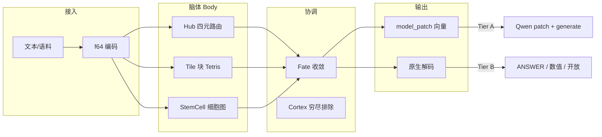

# Valhalla 与 Transformer：详解

**版本**: 1.4 · **日期**: 2026-06-20 · **文档类型**: 技术+实验详解  
**读者**: 技术负责人、架构师、投资尽调工程侧  
**融资 MVP**: [05_融资MVP实验报告.md](./05_融资MVP实验报告.md) · **Fair Benchmark**: [10_FAIR_BENCHMARK_SPEC.md](./10_FAIR_BENCHMARK_SPEC.md) · **多轮 Cycle**: [11_TILE_STEMCELL_CYCLE_EXPERIMENT.md](./11_TILE_STEMCELL_CYCLE_EXPERIMENT.md)

---

## 1. 问题背景：为什么需要「非 Transformer 单一路径」

### 1.1 Transformer 范式的优势与边界

| 优势 | 边界 |
|------|------|
| 通用语言建模、零样本泛化 | 黑箱权重，路由不可审计 |
| 成熟生态（HF、LoRA、KD） | API 税、数据出境、vendor lock-in |
| 规模定律清晰 | 垂直领域需持续梯度训练，算力贵 |

### 1.2 Valhalla 要解决的「孵化」问题

**孵化（Incubation）** 在此指：给定领域语料与任务，系统 **无需完整 backprop 重训**，通过 **结构演化**（Tile 块、StemCell 图、Fate 偏好）使 **可测行为** 发生变化。

这与以下不同：

| 方法 | 机制 | Valhalla 差异 |
|------|------|---------------|
| RAG | 检索 + prompt 拼接 | 结构 **写入** checkpoint，可持久审计 |
| LoRA / 微调 | 梯度更新低秩适配 | **无预设** backprop 为唯一路径 |
| Prompt 工程 | 上下文窗口内指令 | 场/细胞 **多轮收敛**，非单次 prompt |
| 知识蒸馏 KD | Teacher logits → Student | Valhalla Tier A **无训练**；Tier B **无 Transformer forward** |

---

## 2. 系统架构：Hub · Tile · StemCell · Fate



### 2.1 各模块职责

| 模块 | 隐喻 | 工程职责 |
|------|------|----------|
| **Hub** | 调度中枢 | 四元路由（BH/MB/MN/BF）、Fate 偏好、epoch 门控 |
| **Tile** | 俄罗斯方块 | 标量流 → 块合并/分裂 → `tile_signatures` |
| **StemCell** | 干细胞 | 细胞 merge/divide → `stem_signatures`、连接数 |
| **Fate** | 命运收敛 | 探索→收敛两阶段；`get_fate_preferences()` |
| **Cortex** | 皮层 | Difference/Ratio 等变换；Tier B 数值候选 |

### 2.2 TriadSession 与 model_patch

语料逐行 `feed` → `finalize_with_cycles(N)` → 导出：

- `patch_vector`（256 维结构签名）
- `quad_layer_scales`（4 组 LayerNorm 缩放，Tier A 用）
- `tile_signatures` / `stem_signatures`
- `hub_prefs`（Fate 亲和力，Tier B 检索加权）

**关键发现（可复现）**: Tile/Stem **1-cycle 即收敛** — c5/c10 与 c1 结构指标相同；多轮 cycle **不额外增益**（Tier A/B 一致）。

**20260620 详验（Fair 145Q）**: Tile patch_hash c1≡c20、QA +0.00 pp；StemCell patch 变但 QA +0.69 pp（open，CI 含 0）。**persistent 40.7%** 与 **Tier A patch 69%** 才是有效杠杆 — 见 [11_TILE_STEMCELL_CYCLE_EXPERIMENT.md](./11_TILE_STEMCELL_CYCLE_EXPERIMENT.md)。

### 2.3 内部流水线：一行语料进去后发生什么

以 Tier B `run_native_qa` 为例（源码 `manifestsys/hub-f64/src/native_qa.rs`）：

```
1. encode(line) → f64 向量
2. TriadSession::with_body(budget, hub|tile|stemcell|triad)
3. session.feed(Text) — 每行语料 + 问题各 feed 一次
4. finalize_with_cycles(1) → TriadFeedReport
5. 导出: hub_prefs, patch_vector, tile_signatures, stem_signatures
6. score_type 分支:
     mcq     → decode_mcq（hub_prefs 加权选项 cosine）
     numeric → decode_numeric（direct_math / word_problem / cortex）
     open    → decode_open（Fate 加权 memory 检索，无 LM 生成）
```

**Body 参数控制 ingress 范围**（`signal_ingress.rs` · `build_model_patch`）：

| Body | Hub 路由 | Tile 签名 | Stem 签名 | patch_vector |
|------|----------|-----------|-----------|--------------|
| `hub` | ✓ | ✗ | ✗ | 仅 hub_routed + hub_prefs |
| `tile` | ✗ | ✓ | ✗ | 仅 tile_signatures |
| `stemcell` | ✗ | ✗ | ✓ | 仅 stem_signatures |
| `triad` | ✓ | ✓ | ✓ | **三路融合 256 维** |

**200Q 实验观察**：

- **numeric 59 题**：四臂 acc **完全相同**（61.02%）— decode 走算式路径，body 差异不影响
- **MCQ 64 题**：单 hub/tile/stem **14.06%**，triad/baseline **17.19%** — Hub Fate 权重 + 三路融合影响选项排序
- **open 77 题**：四臂 **2.60%** — 检索式，body 几乎无差异；语料仅 flip 4 题（+2/-2=0）

### 2.4 进步 vs 退步（详解版对照）

| | 进步（范式/工程） | 退步或未达成（能力） |
|--|-------------------|----------------------|
| 证据链 | 200Q、body 分离、CI、同题 TF 对标 | 整体 24.5% vs 68% |
| Tier B | 无 HF 端到端；direct_math 满命中 | open 2.6%；cortex 20.7% |
| Tier A | triad 优于 random patch | strict 无净 acc 提升 |
| 语料 | 200Q 诚实 0pp + CI | 48Q +2.08pp 作废 |
| Body | 可分离、triad ≥ 单 body | 单 body -1pp，CI 含 0 |

---

## 3. Tier A：结构 Patch 外部 Transformer

### 3.1 流程

1. medium corpus（56 行）→ `valhalla_model_export --body triad --cycles 1`
2. JSON `model_patch` → Python `apply_valhalla_patch`（strength=0.08）
3. 每题 **fresh load** Qwen2.5-0.5B（防累积 patch 塌缩）
4. `generate` → `score_answer(strict_mcq=True)`

### 3.2 对照臂设计

| 臂 | 目的 |
|----|------|
| hub / stemcell / triad | Valhalla 不同 body 的 patch |
| **random_patch** | 同稀疏度随机 LayerNorm+embed 扰动 |
| **prompt_only** | 语料进 system prompt，不改权重 |
| **logit_kd** | 3B teacher label → 0.5B lm_head SFT |

### 3.3 Strict 48Q 结果（权威）

| Arm | Acc before | Acc after | Gain |
|-----|------------|-----------|------|
| baseline（隐含） | ~68.75% | — | — |
| triad_c1 | 68.75% | 66.67% | **-2.08 pp** |
| stemcell_c1 | 68.75% | 64.58% | -4.17 pp |
| hub_c1 | 68.75% | 58.33% | -10.42 pp |
| prompt_only | 68.75% | 62.50% | -6.25 pp |
| random_patch | 68.75% | 54.17% | **-14.58 pp** |
| **logit_kd** | 68.75% | **91.67%** | **+22.92 pp** |

### 3.4 解读

1. **宽松 MCQ 的 +4.17pp 已作废** — `"B" in "about"` 子串假阳性（见更正文档）。
2. Valhalla patch **触达输出**（变化率 79–92%），但 strict 下 **无净 acc 提升**。
3. triad **优于** hub/stem/random — 结构 **有信息**，非噪声。
4. KD **+22.92pp** 说明：在 **同 48 题、同评分** 下，**有监督梯度** 仍是 acc 最强杠杆 — 与 Valhalla **不同范式**，应并列报告而非对立宣传。

### 3.5 Tier A 有效工程发现

| 发现 | 状态 |
|------|------|
| per-prompt fresh model | 必须；累积 patch @0.08 塌缩 |
| strength 0.08 | 当前默认；更高易 collapse |
| 外部领域题无 Valhalla 幻觉 | 48 题中 Valhalla 关键词命中率 0 |
| Body 分离可复现 | hub/tile/stem/triad export 不同 patch_hash |

---

## 4. Tier B：原生 Valhalla（无 Transformer Forward）

### 4.1 流程

`valhalla_native_qa`（Rust）：

1. corpus + question → `TriadSession::with_body`
2. `finalize_with_cycles` → structure + memories
3. 按 `score_type` 分支：
   - **mcq**: 选项 embedding 打分 → `ANSWER: X`
   - **numeric**: word_problem / direct_math / Cortex 候选
   - **open**: Fate 加权 cosine 检索

### 4.2 Standard 48Q 结果（v2, 20260616_0847）

| Arm | Acc | Δ vs baseline |
|-----|-----|---------------|
| baseline_no_corpus | 22.92% (11/48) | — |
| hub_c1 | 22.92% | 0 |
| stemcell_c1 | 22.92% | 0 |
| triad_c1 | **25.00%** (12/48) | **+2.08 pp** |
| triad_c10 | 25.00% | +2.08 pp |

**数值子集（triad_c1）**: GSM_01–04 ✓, MATH_01–04 ✓, GSM_05 ✗ → **8/9**

### 4.3 v1→v2 改进

| 改进 | 效果 |
|------|------|
| `decode_numeric` + word→digit | GSM 应用题可 word_problem 直算 |
| Cortex Ratio/Difference 候选 | MATH 直算题 |
| Fate hub_prefs 加权检索 | MCQ/open 稳定性 |
| Speak 语料 32 行 | 开放域检索 enrich |

### 4.4 Tier B 边界（必须承认）

- 绝对 acc **~25%**，远低于 Qwen 0.5B baseline **~69%**
- 开放题仍依赖语料检索，非生成式推理
- **不能** 对外称「已替代 Transformer」
- **不能** 对外称「triad 语料 +2.08pp 稳定增益」（200Q 已否定）
- **可以** 对外称「原生路径跑通；numeric 楔子 61% vs 71%；结构 patch 优于 random」

---

## 5. Valhalla vs Transformer：对照表

| 维度 | Transformer (Qwen 0.5B) | Valhalla Tier A | Valhalla Tier B |
|------|-------------------------|-----------------|-----------------|
| 推理主体 | 自注意力层 stack | 同左 + patch | Hub/Tile/Stem 检索+规则 |
| 训练 | 预训练 + 可选 KD | **无训练** | **无 HF** |
| 48Q strict acc | ~69% | patch 后 ~67% (triad) | ~25% (triad) |
| 可审计性 | 权重黑箱 | patch_hash + Fate | 全结构 JSON |
| 部署 | GPU + HF | + export bin | 仅 Rust bin |
| 适用场景 | 通用语言 | 验证结构→行为 | 主权/离线孵化 MVP |

---

## 6. 复现命令

```bash
# 构建
RUSTFLAGS='-L /opt/cuda/lib64' cargo build -p hub-f64 --release \
  --bin valhalla_model_export --bin valhalla_native_qa

# Tier A strict
export HF_ENDPOINT=https://hf-mirror.com
python3 tools/valhalla_model_bridge/run_strict_incubation_experiment.py --phase standard

# Tier B
python3 tools/valhalla_model_bridge/run_tier_b_incubation.py --phase standard

# KD 对照
.venv-llm/bin/python tools/valhalla_model_bridge/run_kd_distill.py --phase standard --train
```

---

## 7. 相关文档

| 文档 | 路径 |
|------|------|
| 实验更正 | `reports/VALHALLA_EXPERIMENT_RECORD_CORRECTIONS_20260616.md` |
| 孵化设计 | `docs/VALHALLA_AI_INCUBATION_BENCHMARK_DESIGN.md` |
| 工程白皮书 | `docs/whitepapers/VALHALLA_TECHNICAL_WHITEPAPER.md` |
| 产品定义 | `docs/VALHALLA_PRODUCT_DEFINITION.md` |

---

## 8. 融资 MVP（200 题，20260616_1143 · Body 分离）

完整报告: [05_融资MVP实验报告.md](./05_融资MVP实验报告.md)

| Arm | Body | Acc | Δ vs baseline | 95% CI |
|-----|------|-----|---------------|--------|
| baseline_no_corpus | triad | 24.50% | — | — |
| hub_c1 | hub | 23.50% | -1.00 pp | [-4.50, +2.50] |
| tile_c1 | tile | 23.50% | -1.00 pp | [-3.50, +1.50] |
| stemcell_c1 | stemcell | 23.50% | -1.00 pp | [-3.50, +1.50] |
| triad_c1 | triad | 24.50% | **0 pp** | [-2, +2] |
| Qwen 0.5B | HF | **68.00%** | — | — |

| score_type | Tier B triad | Transformer |
|------------|--------------|-------------|
| numeric | **61.02%** | 71.19% |
| mcq | 17.19% | 32.81% |
| open | 2.60% | 94.81% |

**要点**: 200Q 上 large 语料对 triad **无显著增益**（0 pp）；单 body 略低于 triad baseline；48Q +2.08 pp 为小样本噪声。Triad = Hub+Tile+StemCell **同时** ingress。

**融资 MVP 判定**: 范式证据 ✓（200Q + body 分离 + CI + 对标）；能力替代 ✗。

---

## 9. 可测试接口与 Vue 可视化

### 9.1 REST API（`api/`）

```bash
cd api && npm install && npm start   # :8780
```

| 端点 | 用途 |
|------|------|
| `GET /api/health` | 服务状态、native_qa 是否可用 |
| `GET /api/experiments/:id` | 200Q JSON |
| `GET /api/bodies` | Hub/Tile/Stem 内部说明 |
| `GET /api/progress` | 进步/退步清单 |
| `POST /api/qa` | Tier B 实跑（`VALHALLA_NATIVE_QA`）或 mock |

### 9.2 Vue 可视化（`viz/`）

```bash
./scripts/start-dev.sh   # API + Vite :5173
```

四个 Tab：**200Q 实验** · **Hub/Tile/Stem 内部** · **进步/退步** · **QA 测试**

---

*Rogue Intelligence LNC. · 详解 v1.4 · 2026-06-20*
